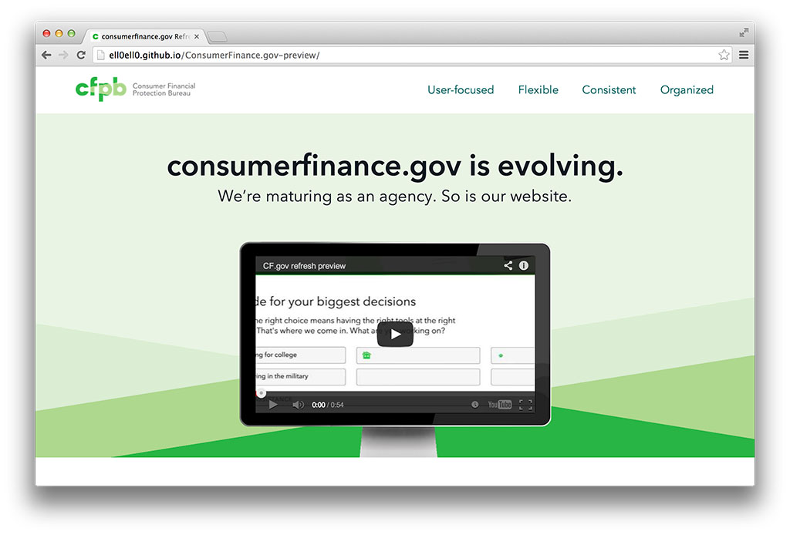

A large part of our effort to refresh Consumerfinance.gov has been to convince the leadership of the value of redesigning the website. They’d bought into the idea in the abstract. We’d done out best to educate them about what responsive design is. We gave them all the analytics on ever increasing mobile usage. We did content and design audits and detailed how fractured the site was becoming. All of that effort was extremely useful, but nothing did more to convince them than this micro site. Myself and another designer concepted, sketched, built, tested and deployed the site and video in about a week. Seeing is believing after all. 

CAVEAT: This site was meant for internal use only so some links and commenting won't work as they link out to a private github enterprise account.

<a class="theme-txt-orange" href="http://ell0ell0.github.io/ConsumerFinance.gov-preview/">Check out the micro site</a>